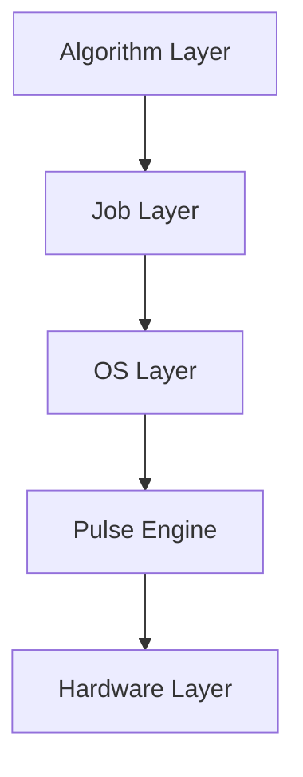

# BockQSC1090


BockQSC1090 is a full-stack quantum system compiler and development package for designing, simulating, and fabricating a 10-qubit superconducting quantum processor.

## Architecture

The project is structured in five layers:



## Documentation

Full documentation is available in the `docs/` folder:
- [Getting Started](docs/getting_started.md)
- [Architecture Details](docs/architecture.md)
- [Hardware Layer](docs/hardware_layer.md)
- [Pulse Engine](docs/pulse_engine.md)
- [OS Layer](docs/os_layer.md)
- [Job Layer](docs/job_layer.md)
- [Algorithm Blocks](docs/algorithm_blocks.md)
- [Big Algorithm Engine](docs/big_algo_engine.md)
- [API Reference](docs/api_reference.md)
- [Project Handoff](docs/project_handoff.md)

## Quick Start

1. **Install dependencies:**
   ```bash
   pip install -e .
   python scripts/setup_env.py
   ```

2. **Run the pipeline:**
   ```bash
   python run_pipeline.py
   ```

3. **Start the Dashboard:**
   ```bash
   streamlit run dashboard.py
   ```

## Disclaimer

This project is a demonstration of a full-stack quantum software framework. Many of the simulation and verification tools generate synthetic data rather than running full quantum physics simulations.
