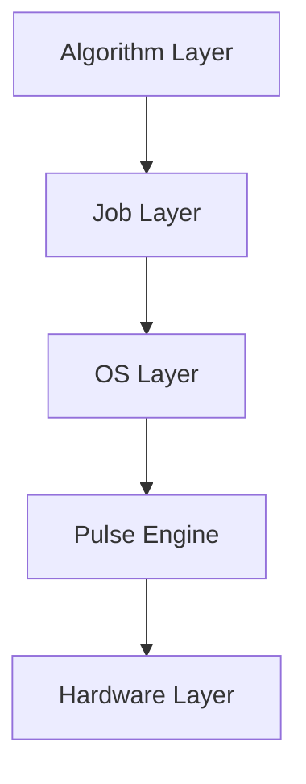

# Architecture

BockQSC1090 is built in five major layers:

1. **Hardware Layer**: 10-qubit QPU layout and GDS generation (uses `gdstk`).
2. **Pulse Engine**: Converts logic gates to physical pulses (Gaussian, DRAG, etc.) and schedules them.
3. **OS Layer**: Coordinates the compiler, scheduler, and executor.
4. **Job Layer**: Manages job queuing and execution.
5. **Algorithm Layer**: High-level quantum algorithms and a `.algo` Domain Specific Language.

