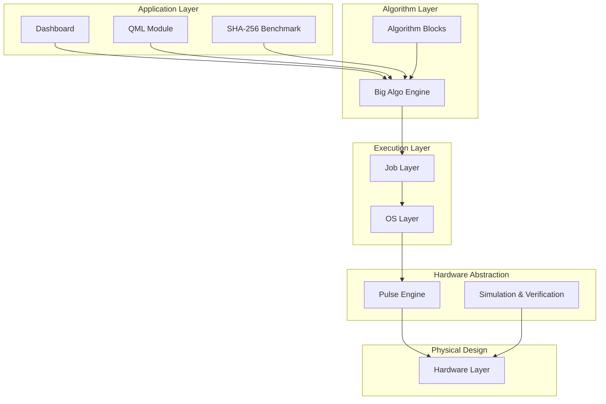

# Architecture

The BockQSC1090 project is structured as a classical-quantum software stack, abstracting the complexities of quantum hardware into manageable, modular layers. The architecture follows a strict top-down execution flow, allowing high-level algorithms to be seamlessly compiled down to physical microwave pulses.

## Layer Diagram

## Layer Descriptions

### 1. Application Layer
The top-most layer provides user-facing interfaces and benchmark suites. The **Dashboard** offers a GUI for interactive testing, while the **QML** and **SHA-256** modules serve as complex, multi-round stress tests for the compiler and execution pipeline.

### 2. Algorithm Layer
The **Big Algorithm Engine** processes custom `.algo` files, acting as the primary DSL parser. It flattens hierarchical operations and validates them against the hardware's supported gate set. The **Algorithm Blocks** library provides modular, reusable quantum subroutines (e.g., QFT, Grover diffusers) that can be chained together.

### 3. Execution Layer
The **Job Layer** manages a queue of pending quantum circuits, abstracting the QPU as a remote resource. The **OS Layer** coordinates the actual lifecycle of a circuit: it receives a job, triggers compilation, requests pulse scheduling, and invokes the execution engine.

### 4. Hardware Abstraction (Pulse Engine)
The **Pulse Engine** bridges the gap between discrete logic gates and continuous physical signals. It maps logical operations to specific microwave envelopes (Gaussian, DRAG) defined in calibration files, schedules them to avoid crosstalk and channel overlap, and synthesizes the final time-domain waveforms.

### 5. Physical Design (Hardware Layer)
The **Hardware Layer** defines the physical topology of the 10-qubit processor. It exports standard GDSII files for fabrication and generates the baseline physical parameters (capacitances, inductances, anharmonicities) used by the downstream simulation layers.
